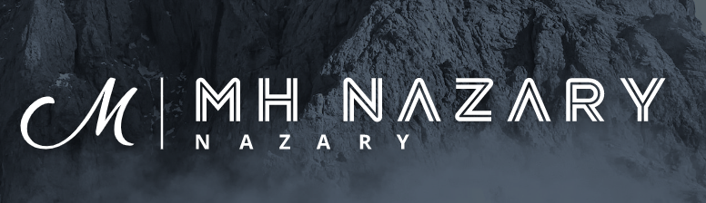

<a name="readme-top"></a>

<!--
HOW TO USE:
This is an example of how you may give instructions on setting up your project locally.

Modify this file to match your project and remove sections that don't apply.

REQUIRED SECTIONS:
- Table of Contents
- About the Project
  - Built With
  - Live Demo
- Getting Started
- Authors
- Future Features
- Contributing
- Show your support
- Acknowledgements
- License

OPTIONAL SECTIONS:
- FAQ

After you're finished please remove all the comments and instructions!
-->

<div align="center">
  <!-- You are encouraged to replace this logo with your own! Otherwise you can also remove it. -->
  
  <br/>

  <h3><b>Best Gaming event!</b></h3>

</div>

<!-- TABLE OF CONTENTS -->

# 📗 Table of Contents

- [📖 About the Project](#about-project)
  - [🛠 Built With](#built-with)
    - [Tech Stack](#tech-stack)
    - [Key Features](#key-features)
  - [🚀 Live Demo](#live-demo)
- [💻 Getting Started](#getting-started)
  - [Setup](#setup)
  - [Prerequisites](#prerequisites)
  - [Install](#install)
  - [Usage](#usage)
  - [Run tests](#run-tests)
  - [Deployment](#triangular_flag_on_post-deployment)
- [👥 Authors](#authors)
- [🔭 Future Features](#future-features)
- [🤝 Contributing](#contributing)
- [⭐️ Show your support](#support)
- [🙏 Acknowledgements](#acknowledgements)
- [❓ FAQ (OPTIONAL)](#faq)
- [📝 License](#license)

<!-- PROJECT DESCRIPTION -->

# 📖 Hello_Microverse_pro<a name="about-project"></a>

>This is Hello_Microverse_pro I created it using HTML, CSS and JavaScript.

## 🛠 Built With <a name="built-with"></a>
1- HTML.
2- CSS.
3- Liners.
4- JavaScript.
### Tech Stack <a name="tech-stack"></a>

<details>
  <summary>Client</summary>
  <ul>
    <li><a href="https://reactjs.org/">HTML</a></li>
    <li><a href="https://reactjs.org/">CSS</a></li>
    <li><a href="https://reactjs.org/">JavaScript</a></li>
  </ul>
</details>

<!-- Features -->

### Key Features <a name="key-features"></a>

- added index.html file.
- added about.html file.
- added style.css file.
- added script.js

<p align="right">(<a href="#readme-top">back to top</a>)</p>

<!-- LIVE DEMO -->

## 🚀 Live Demo <a name="live-demo"></a>

This is the [live demo link](https://mhnazary.github.io/Best-Gaming-Event-2023/) In this [video](https://www.loom.com/share/10a38316db194e76a1c84048f8e41cde) I share a live view of my project while also talking about the creation.


<p align="right">(<a href="#readme-top">back to top</a>)</p>

<!-- GETTING STARTED -->

## 💻 Getting Started <a name="getting-started"></a>

### Prerequisites

1. web browser.
2. code editor.
3. Git-smc.

### Setup

 Run this comand:

```sh
  cd my-folder
  git clone https://github.com/mhnazary/Best-Gaming-Event-2023.git
```
--->

### Install

Install this project with:

Run this comand:

```sh
  cd my-project
  npm install
```
--->

### Usage

### Run tests

> coming soon

### Deployment

> coming soon

<p align="right">(<a href="#readme-top">back to top</a>)</p>

<!-- AUTHORS -->

## 👥 Authors <a name="authors"></a>

👤 Mahram Hossain

- GitHub: [@githubhandle](https://github.com/mhnazary)
- Twitter: [@twitterhandle](https://twitter.com/mh_nazary)
- LinkedIn: [LinkedIn](https://www.linkedin.com/in/mh-nazary-515686204/)


<p align="right">(<a href="#readme-top">back to top</a>)</p>

<!-- FUTURE FEATURES -->

## 🔭 Future Features <a name="future-features"></a>

- [ ] Add footer.
- [ ] Add more styles.
- [ ] Add more functionality
<p align="right">(<a href="#readme-top">back to top</a>)</p>

<!-- CONTRIBUTING -->

## 🤝 Contributing <a name="contributing"></a>

Contributions, issues, and feature requests are welcome!

Feel free to check the [issues page](../../issues/).

<p align="right">(<a href="#readme-top">back to top</a>)</p>

<!-- SUPPORT -->

## ⭐️ Show your support <a name="support"></a>

If you like this project just give it a star.

<p align="right">(<a href="#readme-top">back to top</a>)</p>

<!-- ACKNOWLEDGEMENTS -->

## 🙏 Acknowledgments <a name="acknowledgements"></a>

I would like to thank Microverse to have this opportunity, and also thank you the code review team.
Original design idea by [Cindy Shin in Behance](https://www.behance.net/adagio07)
The original design is under [Creative Commons license of the design.](https://creativecommons.org/licenses/by-nc/4.0/)
Multimedia and content changes were made in this project.

<p align="right">(<a href="#readme-top">back to top</a>)</p>

<!-- LICENSE -->

## 📝 License <a name="license"></a>

This project is [MIT](./LICENSE) licensed.

<p align="right">(<a href="#readme-top">back to top</a>)</p>